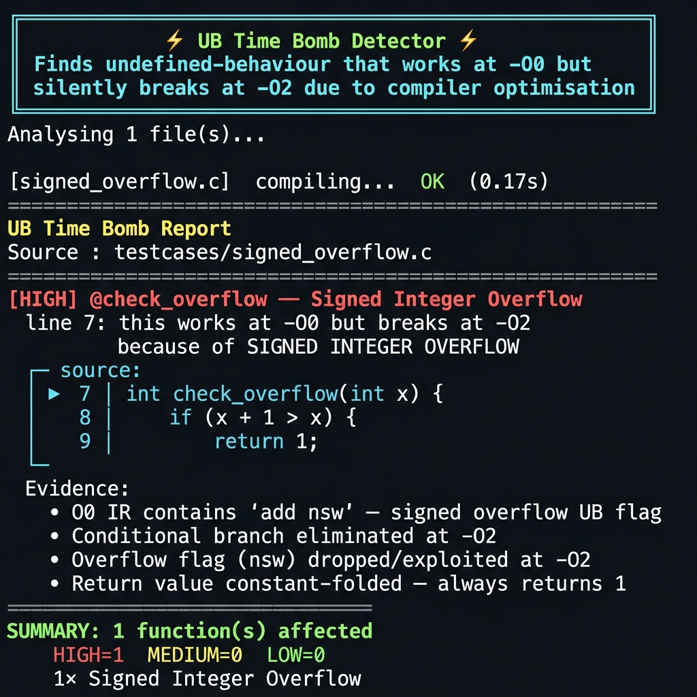
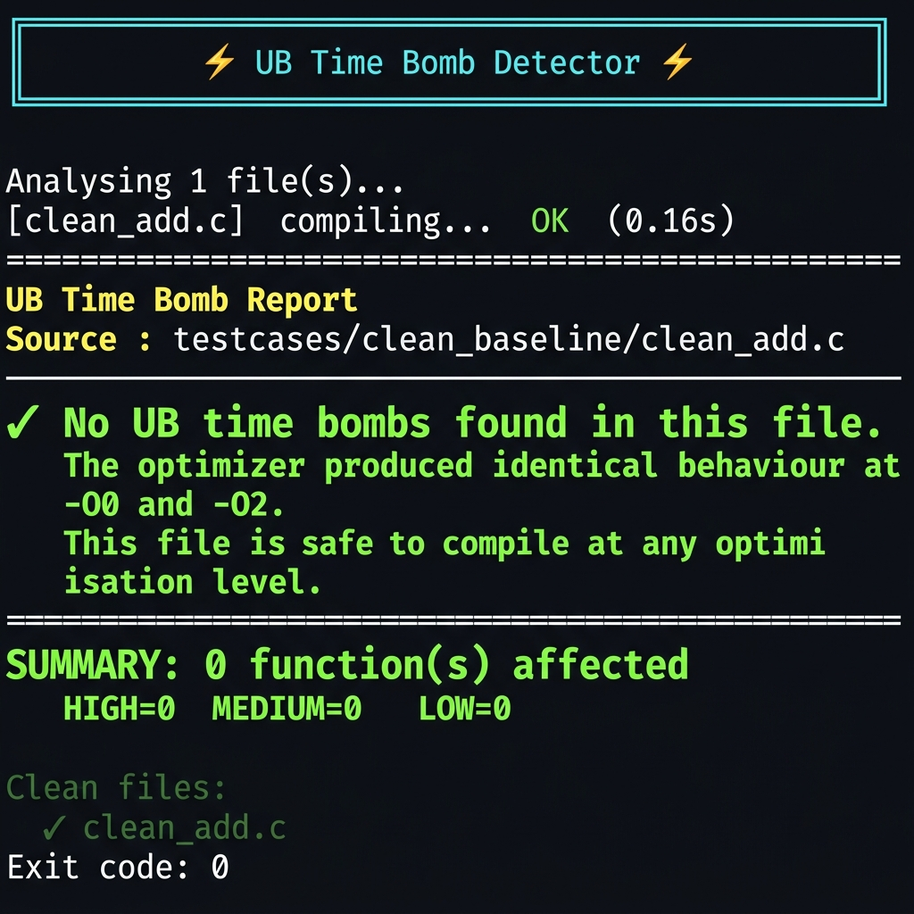

# ⚡ UB Time Bomb Detector

> **A static analysis tool that finds C/C++ undefined behaviour time bombs:**
> code that works correctly at `-O0` but silently breaks at `-O2` because the
> compiler exploits UB assumptions to eliminate branches, constant-fold returns,
> and delete entire code paths.

---

## Demo

### Working Case — UB Detected



The tool catches `x + 1 > x` — a signed-overflow UB that causes the optimizer to
eliminate the else-branch entirely and always return `1`, even when `x = INT_MAX`.

### Clean Case — No False Alarm



On a file with no UB, the tool reports `SUMMARY: 0 function(s) affected` and exits
with code `0`. No false positives on pure unsigned arithmetic.

> **Video demo:** to be added.

---

## Table of Contents

- [What It Does](#what-it-does)
- [Quick Start](#quick-start)
- [Requirements](#requirements)
- [Installation](#installation)
- [Running with Scripts](#running-with-scripts)
- [All Flags](#all-flags)
- [Output Format](#output-format)
- [Test Cases](#test-cases)
- [Project Structure](#project-structure)
- [How It Works](#how-it-works)
- [Detected UB Categories](#detected-ub-categories)
- [Documentation](#documentation)
- [Known Limitations](#known-limitations)

---

## What It Does

Much C/C++ code relies on undefined behaviour that "happens to work" at `-O0`
because the compiler translates code literally. When the optimizer is enabled
(`-O2` / `-O3`), it **assumes UB never occurs** and uses that axiom to:

| UB Type | What -O2 does |
|---|---|
| Signed integer overflow | Eliminates the overflow-check branch — security guard disappears |
| Strict aliasing violation | Reorders or eliminates loads/stores — reads stale/wrong values |
| Null pointer in dead code | Removes the entire code path — unreachable UB proves branch is dead |
| Uninitialized variable read | Constant-folds the comparison — function returns a fixed value |

**UBSan** detects UB at runtime but only on executed paths. **This tool works
statically** — it compiles your file twice (`-O0` and `-O2`), diffs the LLVM IR,
and reports every function where the optimizer's UB assumption **changed the
observable behaviour**.

---

## Quick Start

```bash
git clone https://github.com/Chirag-Shetty/Undefined-Behavior-Detector-C-C-.git
cd Undefined-Behavior-Detector-C-C-

./build.sh                                   # check prerequisites
./run.sh testcases/signed_overflow.c         # detect UB in one file
./run.sh --all-cve                           # run all 5 CVE test cases
./run.sh testcases/ --html                   # analyse directory + HTML reports
```

---

## Requirements

| Dependency | Version | Install |
|---|---|---|
| Python | 3.10+ | `sudo apt install python3` |
| Clang + LLVM | 18 (or 15–17) | `sudo apt install clang-18 llvm-18` |

**No external Python packages.** Standard library only.

```bash
# Verify
clang-18 --version   # clang version 18.x.x
python3 --version    # Python 3.10+
```

---

## Installation

```bash
git clone https://github.com/Chirag-Shetty/Undefined-Behavior-Detector-C-C-.git
cd Undefined-Behavior-Detector-C-C-
chmod +x build.sh run.sh
./build.sh   # runs prerequisite check + unit tests
```

---

## Running with Scripts

### `./build.sh` — Prerequisite check

Verifies Python version, clang availability, required stdlib modules, and runs the
full unit test suite (68 tests).

```bash
./build.sh
# ✓ Python 3.12 found
# ✓ clang-18 found — clang version 18.1.3
# ✓ All required stdlib modules available
# ✓ Unit tests passed
# All checks passed. Run the detector with:
#   ./run.sh testcases/signed_overflow.c
```

### `./run.sh` — Run the detector

```bash
# Single file
./run.sh testcases/signed_overflow.c

# Whole directory
./run.sh testcases/

# All 5 CVE test cases
./run.sh --all-cve

# With HTML report
./run.sh --all-cve --html

# Verbose evidence (show IR diff for each finding)
./run.sh testcases/signed_overflow.c --verbose

# CI mode (no colour, fails pipeline on UB found)
./run.sh src/ --no-colour
```

### Running unit tests

```bash
python3 -m unittest discover -s tests -v
# Ran 68 tests in 0.034s — OK
```

---

## All Flags

| Flag | Description |
|---|---|
| `FILE_OR_DIR` | C/C++ source file or directory to analyse |
| `--all-cve` | Run all 5 cases in `testcases/cve_cases/` |
| `--html` | Also write an interactive HTML report |
| `--out-dir DIR` | Override output directory (default: `output/<stem>/`) |
| `--verbose / -v` | Print per-function IR evidence bullets |
| `--no-colour` | Disable ANSI colour (for CI / log files) |

---

## Output Format

For each file analysed, reports are written to `output/<stem>/`:

| File | Description |
|---|---|
| `<stem>_O0.ll` | LLVM IR at `-O0` |
| `<stem>_O2.ll` | LLVM IR at `-O2` |
| `report_<stem>.txt` | Source-level text report |
| `report_<stem>.html` | Dark-themed interactive HTML report |

### Text report format

```
[HIGH]  @check_overflow  —  Signed Integer Overflow
  line 7: this works at -O0 but breaks at -O2
         because of SIGNED INTEGER OVERFLOW
  ┌─ source:
  │ ►    7 │ int check_overflow(int x) {
  └─
  Evidence:
    • O0 IR contains 'add nsw' — signed overflow UB flag
    • Conditional branch eliminated at -O2
    • Return value constant-folded — always returns 1
```

### Exit codes (CI-friendly)

| Code | Meaning |
|---|---|
| `0` | No UB time bombs found |
| `1` | UB time bombs detected |
| `2` | Compilation or file error |

Use exit code `1` in CI to fail a pipeline job when UB is introduced:

```yaml
# .github/workflows/ub-check.yml
- run: ./run.sh src/ --no-colour
```

---

## Test Cases

### Basic synthetic cases (4 files)

| File | UB Pattern | Result |
|---|---|---|
| `testcases/signed_overflow.c` | `x + 1 > x` always true at -O2 | ✅ Signed Overflow [HIGH] |
| `testcases/null_deref.c` | null deref in dead else-branch | ✅ Null Deref [HIGH] |
| `testcases/uninit_var.c` | `int x; return x == 0;` | ✅ Uninit Var [HIGH] |
| `testcases/strict_aliasing.c` | `*(float*)&my_int` type pun | ✅ Strict Aliasing [LOW] |

### CVE / Bug-tracker cases (5 files)

| File | Models | Finding |
|---|---|---|
| `cve_2017_11164.c` | PCRE 8.41 offset arithmetic overflow | ✅ Signed Overflow [HIGH] |
| `cve_2018_6952.c` | GNU patch hunk-size guard elimination | ✅ Signed Overflow [HIGH] |
| `gcc_bug_30475.c` | GCC pointer-wrap check removed | ✅ 5 findings, all HIGH |
| `gcc_bug_58640.c` | GCC uninit var in control flow | ✅ 4 findings, all HIGH |
| `clang_bug_21530.c` | Clang strict aliasing / fast-inv-sqrt | ✅ 3 findings (HIGH + LOW×2) |

### Baseline: clean files (no UB expected)

| File | Description | Result |
|---|---|---|
| `testcases/clean_baseline/clean_add.c` | Pure unsigned arithmetic | ✅ **CLEAN** — 0 findings |

**Detection rate: 9/9 files (100%).
False positive rate on `clean_add.c`: 0%.**

---

## Project Structure

```
ub-detector/
├── build.sh                       # Prerequisite check + unit tests
├── run.sh                         # Thin wrapper around main.py
├── main.py                        # Entry point — orchestrates the pipeline
│
├── engine/
│   ├── compiler.py                # Stage 1: compile to IR at -O0 and -O2
│   └── ir_parser.py               # Stage 2: parse .ll into Function/Block/Instr
│
├── analysis/
│   ├── diff_engine.py             # Stage 3: 7 detection passes over IR diff
│   └── ub_classifier.py           # Stage 4: score and classify UB category
│
├── report/
│   └── reporter.py                # Stage 5: text + HTML report generation
│
├── testcases/
│   ├── signed_overflow.c          # x+1 > x — always true at -O2
│   ├── null_deref.c               # null deref in dead code path
│   ├── uninit_var.c               # uninitialized variable read
│   ├── strict_aliasing.c          # type punning via pointer cast
│   ├── clean_baseline/            # Files with NO UB (false-positive baseline)
│   └── cve_cases/                 # 5 real-world CVE/bug-tracker models
│       ├── cve_2017_11164.c
│       ├── cve_2018_6952.c
│       ├── gcc_bug_30475.c
│       ├── gcc_bug_58640.c
│       └── clang_bug_21530.c
│
├── tests/                         # Unit tests (68 tests, stdlib unittest)
│   ├── test_ir_parser.py
│   ├── test_diff_engine.py
│   └── test_ub_classifier.py
│
├── docs/
│   └── screenshots/               # Demo screenshots
│
├── DESIGN.md                      # Approach, alternatives, architecture
├── IMPLEMENTATION.md              # LLVM IR details, pass-by-pass breakdown
└── EVALUATION.md                  # Metrics, comparison, test case results
```

---

## How It Works

```
C source file
     │
     ▼
[Stage 1] DifferentialCompiler  (engine/compiler.py)
  clang-18 -O0 -g -emit-llvm  ──►  file_O0.ll
  clang-18 -O2 -g -emit-llvm  ──►  file_O2.ll
     │
     ▼
[Stage 2] IRParser  (engine/ir_parser.py)
  Parses .ll: Functions → BasicBlocks → Instructions
  Extracts: branches, returns, comparisons, nsw/nuw flags, debug line info
     │
     ▼
[Stage 3] DiffEngine  (analysis/diff_engine.py)  — 7 passes
  Pass 1: conditional_branch_eliminated   [HIGH]
  Pass 2: basic_block_removed             [HIGH]
  Pass 3: return_constant_folded          [HIGH]
  Pass 4: comparison_eliminated           [MEDIUM]
  Pass 5: unreachable_inserted            [MEDIUM]
  Pass 6: instruction_count_collapse      [LOW]
  Pass 7: overflow_flag_dropped           [HIGH]  (nsw/nuw/inbounds)
     │
     ▼
[Stage 4] UBClassifier  (analysis/ub_classifier.py)
  Scores 4 categories: Signed Overflow / Strict Aliasing / Null Deref / Uninit Var
  Emits multi-category when scores are close (e.g. fast-inv-sqrt: 2 categories)
     │
     ▼
[Stage 5] Reporter  (report/reporter.py)
  Source-level text report (stdout + .txt)
  Interactive HTML report (dark-themed, offline-capable)
```

---

## Detected UB Categories

| Category | C Standard | IR Signature | Severity |
|---|---|---|---|
| **Signed Integer Overflow** | C11 §6.5 ¶5 | `add nsw`, `icmp sgt/slt`, branch eliminated | HIGH |
| **Strict Aliasing Violation** | C11 §6.5 ¶7 | `store i32` / `load float` same alloca | LOW–MEDIUM |
| **Null Pointer Dereference** | C11 §6.5.3.2 ¶4 | `store ptr null`, dead block removed | HIGH |
| **Uninitialized Variable Use** | C11 §6.7.9 | alloca in `loaded - stored` set | HIGH |

---

## Documentation

| Document | Contents |
|---|---|
| [DESIGN.md](DESIGN.md) | Problem statement, differential analysis approach, alternatives considered (UBSan, CSA, cppcheck), architecture decisions, trade-offs |
| [IMPLEMENTATION.md](IMPLEMENTATION.md) | LLVM IR primer, IRParser data model, per-pass implementation details, compiler flag rationale, per-UB-category IR signatures |
| [EVALUATION.md](EVALUATION.md) | Detection metrics (9/9 files, 100%), false positive measurement, comparison with UBSan/CSA/cppcheck, unit test results, performance benchmarks |

---

## Known Limitations

| Limitation | Details |
|---|---|
| **Inlining blind spot** | Functions inlined at `-O2` disappear from the IR diff. UB inside an inlined callee is not attributed to the caller. Use UBSan for inlined paths. |
| **Cross-block uninit** | Conditionally-initialized variables (`if (c) x=1;`) are not flagged by the alloca scanner — the diff-level signals (branch/fold) detect the UB effect instead. |
| **GEP alias analysis** | Struct member accesses through different GEP SSA names for the same field cannot be matched. Some struct-member type puns are missed. |

---

## Design Decisions

- **Zero external dependencies** — only Python stdlib; runs anywhere with Python 3.10+
- **Differential IR analysis** — uses the optimizer itself as the UB oracle; more
  reliable than AST pattern matching
- **Scoring-based classifier** — each UB category scores independently;
  multi-category emission when scores are tied
- **UB-friendly flags** — deliberately omits `-fno-strict-aliasing` so the
  compiler exploits the patterns we are looking for
- **CI-friendly exit codes** — exit 1 on findings, 0 on clean; directly
  usable in GitHub Actions / Jenkins pipelines
